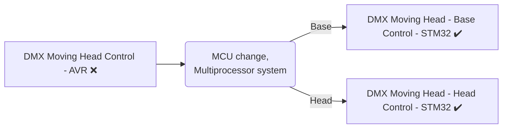
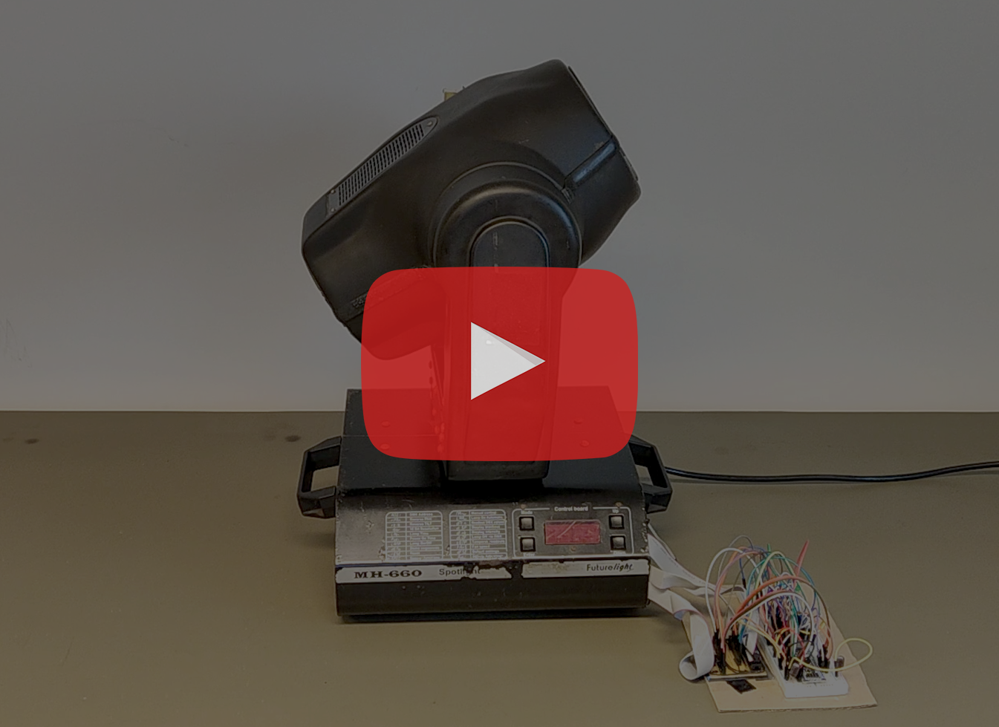
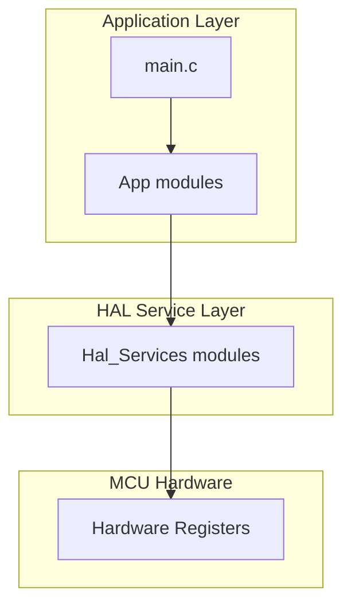
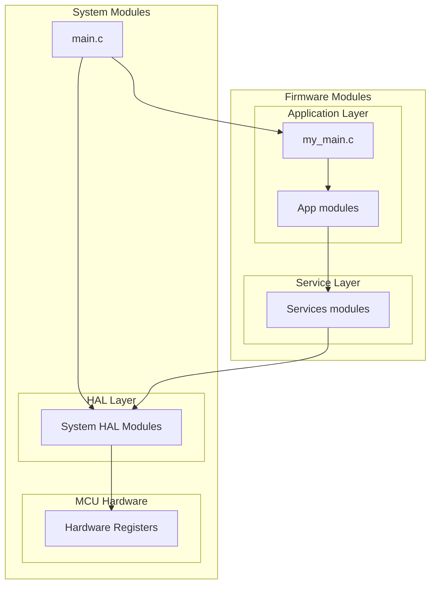

# DMX Moving Head - Base controlling firmware for STM32F401CCU6 microcontroller

> ### ❗❗ Bachelor's Thesis
> **Note:** I wrote my **[Thesis](https://drive.google.com/file/d/1uE1WsgICa_NFbQyPtikY8qTVwxYJvNp_/view?usp=sharing)** from this project. All references in the thesis correspond to version **[Final 1.0](https://github.com/bagobalint10/dmx-moving-head-control-h-stm32/commit/c273c5aa583344c6a1a916a604c60148dd93bfc8)** of this repository. 


## General Information

This project aimed to create a fully functional control system for a `Futurelight MH-660` moving head based on an `STM32F401CCU6` ARM microcontroller, because I owned one of these units, but it didn't work well.

I started developing on an 8-bit AVR Microcontroller, but during the project, it became clear that this AVR MCU didn't have enough peripherals (specifically 16-bit timers ) and an FPU. Both of these were necessarry for the final project, that needs to control multiple motors at the same time and calculating acceleration. 
Therefore I decided to migrate the project to another Microcontroller. I chose an `STM32F401CCU6` because it has two 32-bit timers and an FPU. After realizing this Microcontroller didn't have enough pins and PWM channels for the entire project, I divided the project into two parts. 
One MCU is solely responsible for controlling the head motors, while the other manages the base motors and the control panel (acting as the master device). These projects have been completely finished and can be viewed these repositories.


Base Repository: **[dmx-moving-head-control-b-stm32](https://github.com/bagobalint10/dmx-moving-head-control-b-stm32)**

AVR Repository: **[dmx-moving-head-control-avr](https://github.com/bagobalint10/dmx-moving-head-control-avr)**




### Video of the final device in operation

[](https://www.youtube.com/watch?v=WdRwiUQ4uc4)

## Technical Specifications

MCU: STM32F401CCU6

Language: C 

IDE: STM32CubeIDE 1.15.1

Hardware: Futurelight MH-660 Moving Head

## Features

- ✔️ Reading DMX signal
- ✔️ Controlling head's stepper motors
    - ✔️ All (8pcs) motors
- ✔️ Controlling all features
    - ✔️ Set focus
    - ✔️ Changing color
    - ✔️ Brightness
    - ✔️ Strobe freq
    - ✔️ Switching prism
    - ✔️ Rotating prism
    - ✔️ Changing gobo
    - ✔️ Rotating gobos

✔️ = Done, ❌ = Interrupted

## Software Architecture

The firmware follows a layerd architecture for easier portability and maintainability. The official AVR project is followed this sw architecture:


When I migrated the previous project to the STM32 architecture It became clear to me, that I couldn't follow the same simple architecture. Because the CubeIDE already has a Hardware Abstraction Layer (HAL) which I didn't want to modify. This development environment also automatically generates the peripheral initialization codes, therefore the `main.c` file is easily becomes messy. I wanted to hide this in the "background", therefore I placed my modules on top of the STM32 software architecture. After that, my complete SW A. looked like this:



### Application Layer - [App/](Firmware/App/)

- The software modules in this layer are using the  Service Layer to communicate with the software/hardware and contain the high-level logic.

### Service Layer - [Services/](Firmware/Services/)

- The software modules in this layer are using the  HAL Layer to communicate with the hardware and contain low-level drivers.


## Folder Structure

```

           
Firmware/                   # all firmware modules
    ├── my_main.c           # same as avr project main.c
    ├── App/                # app layer 
    │   ├── Inc/            # header files
    │   └── Src/            # source files
    └── Services/           # service layer
        ├── Inc/            # header files
        └── Src/            # source files

``` 

## Author 
[Bagó Bálint](https://github.com/bagobalint10) – [LinkedIn](https://www.linkedin.com/in/b%C3%A1lint-bag%C3%B3-49000123a/)  

2025/11/06

